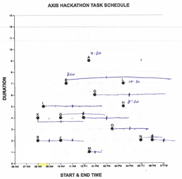
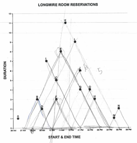
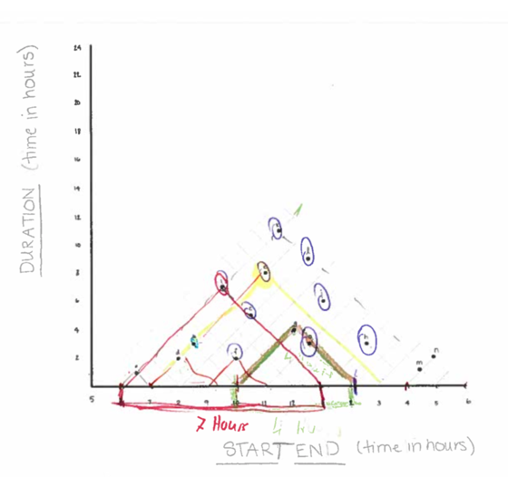
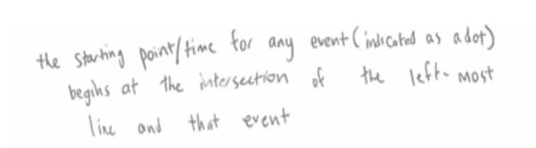

# Observing learning of an unconventional statistical graph {.tabset .tabset-fade .tabset-pills}  
  

## Introduction    

**What strategies do we employ to make sense of an unfamiliar graph?**   
In this exploratory study we observed students solving problems with a novel graph.  After learning how the graph works, we challenged students to design instructional aids to make the graph “easier to read”. From these data we generate hypotheses for how we might scaffold comprehension for novel representations. 

## Methods   

### Design

Video-observation of problem-solving behavior + post-task interview & design task. The entire procedure ranged from 45 - 60 minutes. 
 

### Participants   

Twenty-three (70% female) English speakers from the experimental-subject pool at a large American university (M(age) = 20, SD(age) = 1) participated in exchange for course-credit. All students were majors in STEM subjects. Participants were recruited in dyad pairs (9 pairs, n = 18) to encourage the naturalistic think-aloud protocol. In
cases where one recruit was absent we conducted the session with the individual (n = 5), altering the procedure only by encouraging them to think-aloud as though explaining their reasoning to a partner. In total, we conducted 14 observation sessions (9 dyads, 5 individuals).
 

### Materials   

#### Part A: Graph Reading Task   
In the Graph Reading Task, sixteen multiple choice questions were used to probe the reader’s ability to use the graph to reason about the properties of and relations between intervals. For example, a question testing the “duration” property might read: "For how many hours does event [x] last?" Participants were given one sheet of paper
containing the questions and a second sheet containing a large TM graph with 15 data points.  After delivering instructions, we started the video recording and left the room.  Questions can be found <!--html_preserve--><a href="static/Study1/graph_reading_task.pdf">here</a><!--/html_preserve--> and TM graph <!--html_preserve--><a href="static/Study1/Axis_Triangular.pdf">here</a><!--/html_preserve-->.
      

<!--html_preserve-->

<b>Figure 1. Setup of the Graph Reading Task</b>
<!--/html_preserve-->
 

#### Post-Task Interview   
Upon task completion, we conducted a short interview, prompting participants to explain how they would plot a new data point on the graph. If participants misinterpreted the graph, we began a didactic interview, prompting students to ask questions they thought might help them discover the rules of the graph system. We responded by only revealing the information explicitly requested, minimizing the effect our teaching might have on the designs produced in the next task.
      

#### Part B: Scaffold Design Task   
The the Scaffold Design Task we asked participants to think about what they could do to make the graph easier to read for the next participant and invited them to make marks on the graph.
      

## Results (Graph Reading Task)   
Participants in only 3 of the 14 sessions correctly interpreted the TM graph (M(score) = 12 / 16 points, (SD = 1.7), (M(time) = 19 min, SD = 30s). (see raw data  <!--html_preserve--><a href="static/Study1/2YP_OBS_MAIN.pdf">here</a><!--/html_preserve-->) These participants correctly described the graph’s rules in the post-task interview. In the remaining 11 sessions, participants correctly answered only 2.2 ques- tions on average (SD = 2.1), and were unable to correctly plot a point in the interview. Yet in these sessions, participants did persist in answering all questions, spending about the same amount of time on the task (M(time) = 21 min, SD=2 min).   
 
Reviewing the artifacts participants generated during the graph reading task gives us a window into how they interpreted the graph.  Looking first at the lowest scoring sessions, we noticed several cases where participants appeared to superimpose the conventional linear model over top of the triangular graph (see figure 2) have dubbed this the “linear interpretation” of the TM.  This interpretation relies on participants assuming that the data points are situated in a conventional Cartesian coordinate system with a single x and y intercept for each point. They must infer that a point represents a moment in time, not an interval of time, and that the interval is represented by a line segment which they must project (or draw) atop the graph.  They must also decide which moment along an interval the point represents.  In this sense, the “linear interpretation” relies on two kind of prior knowledge: first of Cartesian coordinates in which a point has a single x-intercept, and secondly of conventions for representing intervals: as linear extents, rather than as points.  In our sample, participants decided the point referred to the start time.  This interpretation also requires students to ignore, or assign no meaningful referent to the graph’s diagonal gridlines. Once constructed, participants can extract information from the “linear interpretation” following the same procedure one would follow for the LM graph. 

<!--html_preserve-->
<table style="width:100%">
  <tr>
    <td></td> 
    <td></td> 
    <td></td> 
  </tr>
  <tr> <b>Figure 2A. Artifacts for lowest scoring sessions of Graph Reading Task</b>
<i>Note: When digitally-scanning the physical drawings, the diagonal gridlines of the TM were desaturated. In the printed graphs used by participants the gridlines were prominent.</i> 
  </tr>
</table>
   

<table style="width:100%">
  <tr>
    <td></td> 
  </tr>
  <tr> <b>Figure 2B. Artifacts for highest scoring session of Graph Reading Task</b>
  </tr>
</table>

<!--/html_preserve-->
 
Alternatively, In Figure 2b we see the artifact from the highest scoring session. Participants have reinforced the triangular intersections for several points with the x-axis. Noticeably, we do not see reinforcement of the intersections with the y- axis, presumably because this is a convention of the coordinate system participants did not need assistance to interpret.   

## Results (Scaffold Design Task)   

We evaluated the artifacts produced in response to our prompt to make the graph easier to read, and found evidence of three instructional approaches: adding pictorial intersections (Figure 3a), providing annotations/examples (Figures 3b, 3c) and text instructions (Figure 3d).

<!--html_preserve-->
<table style="width:100%">
  <tr>
    <td></td> 
    <td><b>Figure 3A. Pictorial Intersections</b>  Participants have drawn attention to the diagonal gridlines and their dual-intersections with the x-axis by darkening and coloring them. These partici- pants explained the most challenging part of the graph was realizing they had to look for two intersections with the x-axis.
</td> 
  </tr>
  
  <tr>
    <td></td> 
    <td><b>Figure 3B. Annotations & Examples. </b>Participants have annotated their highlighted intersections. We see a partial worked example, via the annotation “7 hours” to the span for the red interval.
</td> 
  </tr>
  <tr>
    <td></td> 
    <td><b>Figure 3C. Worked Example </b>A worked example where participants both highlighted the intersection and gave explicit values for a sample point on the plot. Under the graph they added a production rule for finding the start-time of a hypothetical point “S”, indicating that some learners may prefer text in- structions. </td> 
  </tr>
  
  <tr>
  <td></td> 
  <td><b>Figure 3D. Worked Example </b>Explanatory text with an explicit definition of several graph elements.
</td> 
  </tr>
</table>
   

<!--/html_preserve-->

## Discussion

The results of Study One suggest the Triangular Model (TM) graph is challenging for STEM undergraduates. While the graph is elegant in its simplicity —as one participant noted, “once you see [the triangles], you can’t (sic) unsee them”— most re-imagined the marks on the page as components of the more conventional representation for intervals. In interpreting this graph students invoked prior knowledge of conventions for the domain (intervals as line segments) and graphs in general (Cartesian coordinates). When prompted for instructional aids, students believed they could easily improve performance of future participants by adding instructions highlighting the multiple intersections of a point with the x-axis. Importantly, these scaffolds are substantively different than those explored in previous literature. These instructions are most similar to graphical cues, but rather than reinforcing the main argument of the graph (e.g. local maxima/minima, salient trend, etc.) they draw attention to the structure of the coordinate system. Both text and image instructions focus on the graphical framework and how to perform a first-order reading, rather than reinforcing the connection between the graph’s signifiers and referents.
Owing to the limited sample size and observational methods, we fall short of explaining why some students (3 sessions) were able to interpret the graph while most were not. In one case, an individual interpreted the graph in the very first question, but failed to think-aloud, leaving their strategy a mystery. In the second case, the dyad pair also developed a correct model in the first question. In the third case, the dyad read the graph incorrectly for about half the questions before realizing their mistake and re-solving the problem set. These outcomes could be driven by individual differences in graphical competency, or different problem-solving strategies. Addressing this question will require further observation with directed post-task interviews.

