```{r echo = FALSE}
#LOAD PACKAGES
suppressPackageStartupMessages({
  library(tidyverse)
  library(stringr)
  library(readr) #load csv
  library(pastecs) #stat.desc
  library(tables) # pretty tables
  library(dplyr) #data formatting
  library(ez) #mixed anova
  library(reshape2) #reformatting data
  library(car)   #statistics
  library(ggplot2) #graphs!
  library(psych) #describeby
  library(gridExtra) #arranging plots
  library(ez) #mixed anova
library(nlme) #multilevel model
library(lme4) #better mixed model
library(WRS2) #robust tests
})
```

```{r echo = FALSE}
#LOAD THE PARTICIPANT DATA
all_participants <- read_csv("../STUDY_2/Analysis/xls-files/master-wrangled-data/all_participants.csv", 
    col_types = cols(ARF = col_skip(), Comments = col_skip(), 
        `Graph Description (if other)` = col_skip(), 
        `Graph Title` = col_skip(), `Graph Type` = col_factor(levels = c("Triangular (right angle)", 
            "Triangular", "Linear Model", 
            "Scatterplot", "Other", "Triangular (asymmetric)")), 
        Points = col_skip(), Rater = col_skip(), 
        `Select each item that is labelled in the graph` = col_skip(), 
        `X Axis` = col_skip(), `Y Axis` = col_skip(),
        GENDER = col_factor(levels = c("Male", 
        "Female","Other")),
        condition = col_factor(levels = c("0", 
            "1", "2", "3", "4")), d_t = col_skip(), 
        d_t_2 = col_skip(), experiment = col_factor(levels = c("experiment", 
            "reverse")), linear_time = col_skip(), 
        lm_scenarios = col_factor(levels = c("axis", 
            "longmire")), ls_t = col_skip(), 
        lt_t = col_skip(), time_diff = col_skip(), 
        tm_scenarios = col_factor(levels = c("longmire", 
            "axis")), triangular_time = col_skip(), 
        ts_t = col_skip(), tt_t = col_skip() ))
#View(all_participants)
```

```{r echo = FALSE}
#SETUP LABELS AND COLORS FOR GRAPHS
order_labels <- c(LMFirst = "linear-first", TMFirst = "triangular-first")
scenario_labels <- c(axis = "task-scenario A", longmire = "event-scenario B")
condition_labels <-c( '0' = "no scaffold", '1' = "what-text", '2' = "how-text", '3' = "static image", '4' = "interactive image")
task_labels <- c("LM_T_M" = "linear graph", "TM_T_M" = "triangular graph")

  red = "#F8766D"
  green = "#1cc07e"
  blue = "#59A1FC"
  purple = "#C680FD"
  none = "#7E7D7E"
  text1 = "#071FD5"
  text2 = "#0C91DF"
  img1 = "#EF007A"
  img2 = "#c481d5"
```

```{r echo = FALSE}
#SETUP DATA FRAMES
#create copy data of base data frame 
df_subjects <- cbind(all_participants)

#create a new column for order with better name
df_subjects$order = df_subjects$experiment
levels(df_subjects$order)[levels(df_subjects$order)=="experiment"] <- "LMFirst"
levels(df_subjects$order)[levels(df_subjects$order)=="reverse"] <- "TMFirst"

#create a column for the sum of the two graphing tasks (graphScore)
df_subjects$graphScore = df_subjects$linear_score + df_subjects$triangular_score

#create a column for the sum of the two drawing tasks (graphScore)
df_subjects$drawScore = df_subjects$points + df_subjects$d_n

#create data subsets
df_regular <- subset(df_subjects, experiment=="experiment")
df_reverse <- subset(df_subjects, experiment=="reverse")
```

# Evaluating scaffolds for an unconventional statistical graph {.tabset .tabset-fade .tabset-pills}  
<br> 

## Introduction    
<br>
In Study Two we examine if scaffolding is effective in aiding untrained students to understand the Triangular Model (TM) graph.  We know that students are unlikely to construct the correct interpretation of the TM without assistance.  Guided by the results of the Study One Design Task, we created four scaffolds.  We test the effectiveness of these scaffolds by seeking to replicate the Qiang et.al (2014) finding that after 20 minutes of video training, students perform faster and more accurately with the unconventional TM than the conventional Linear Model (LM). Will our participants show similar performance on the TM with scaffolds rather than formal instruction? Further, will engagement with the TM in a reading task be sufficient for students to reproduce the graph in a subsequent drawing task?  
<br>

### Hypotheses
1. Learners without scaffolding (control) will perform better with the LM than TM    
2. Learners with (any form of) scaffolding will perform better with the TM than LM (replication of [12]).     
3. Based on observations in Study One we expect that graph-order will act as a scaffold. Learners who solve problems with the LM graph first will perform better on the TM (relative to TM-first learners) as their attention will be drawn to the salient differences between the graphs.    
<br>   

--- 
**To try the study yourself: **
visit http://morning-gorge-17056.herokuapp.com/     
*Enter "github" as your session code, and number of the condition you wish to test*    
0 = control (no-scaffold), 1 = "what-text", 2 = "how-text", 3 = "static-image", 4 = "interactive-image"     
<br> <br>


## Methods   
### Design
We employed a 5 (scaffold: none-control, what-text, how-text, static image, interactive image) x 2 (graph: LM, TM) mixed design, with scaffold as a between-subjects variable and graph as a within-subject variable. To test our hypothesis that exposure to the conventional LM acts as a scaffold for the TM, we counterbalanced the order of graph-reading tasks (order: LM-first, TM-first). For each task we measured response accuracy and time.  For the follow-up graph-drawing task, a team of raters coded the type of graph produced by each participant.  
<br>  

### Participants
```{r echo = FALSE}
#EXPLORE SAMPLE STATISTICS

#record sample size
nSubjects = nrow(df_subjects)
nReg = nrow(df_regular)
nRev = nrow(df_reverse)

#how many women?
nFemale <-nrow(filter(df_subjects, df_subjects$GENDER == 'Female'))

#describe the sample
descriptives<-stat.desc(df_subjects)
#descriptives

#determine age range
age_min = descriptives$AGE[4]
age_max = descriptives$AGE[5]
age_m = round(descriptives$AGE[9], 2)
age_sd = round(descriptives$AGE[10], 2)


time_min = round(descriptives$TOTAL_T_M[4], 0)
time_max = round(descriptives$TOTAL_T_M[5], 0)
time_m = round(descriptives$TOTAL_T_M[9], 0)
time_sd = round(descriptives$TOTAL_T_M[10], 2)

```

`r nSubjects` (`r round(nFemale/nSubjects,2) * 100`% female) students aged `r age_min` to `r age_max` at a public American univeristy participated in the study. 
All participants completed three activities: two graph reading tasks (with both the linear model (LM) and triangular model (TM) graphs) followed by a drawing task. In some cases (linear-first), participants (n = `r nReg`) completed the graph reading task with the LM graph, followed by the task with the TM graph. An additional (n= `r nRev`) subjects completed the graph reading tasks in reverse order. Each particiant was randomly assigned to one of five conditions which determined what additional information (scaffold) they received while solving the first five problems with each graph: no-scaffold (control), 'what' text, 'how'-text, static-image, and interactive-image. The runtime of the entire study ranged from `r time_min` to `r time_max` minutes (m = `r time_m`, sd = `r time_sd`). 
<br> <br>

### Materials
#### Scaffolds
For the first five questions of each graph-reading task, participants saw their assigned scaffold along with the designated graph. On the following ten questions, the scaffold was not present. Examples of each scaffold-condition for the TM and LM graphs are shown below. 
<br> <br>

<!--html_preserve-->
<table style="width:100%">
  <tr>
    <th>Scaffold Condition</th>
    <th>Linear Model (LM)</th>
    <th>Triangular Model (LM)</th> 
  </tr>
  <tr>
    <td>none-control</td>
    <td></td> 
    <td></td> 
  </tr>
  <tr>
    <td>"what-text"</td>
    <td>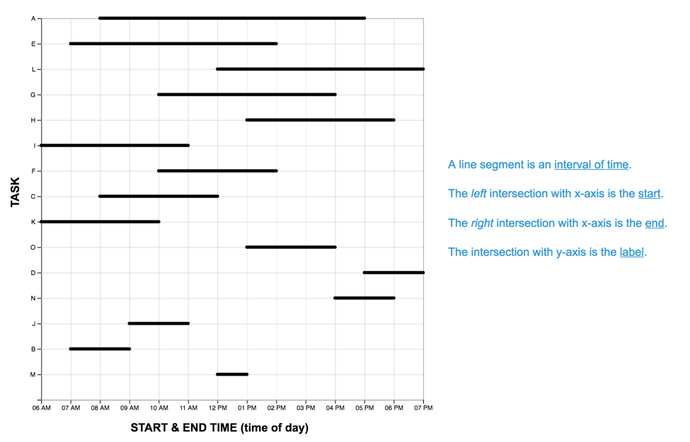</td> 
    <td>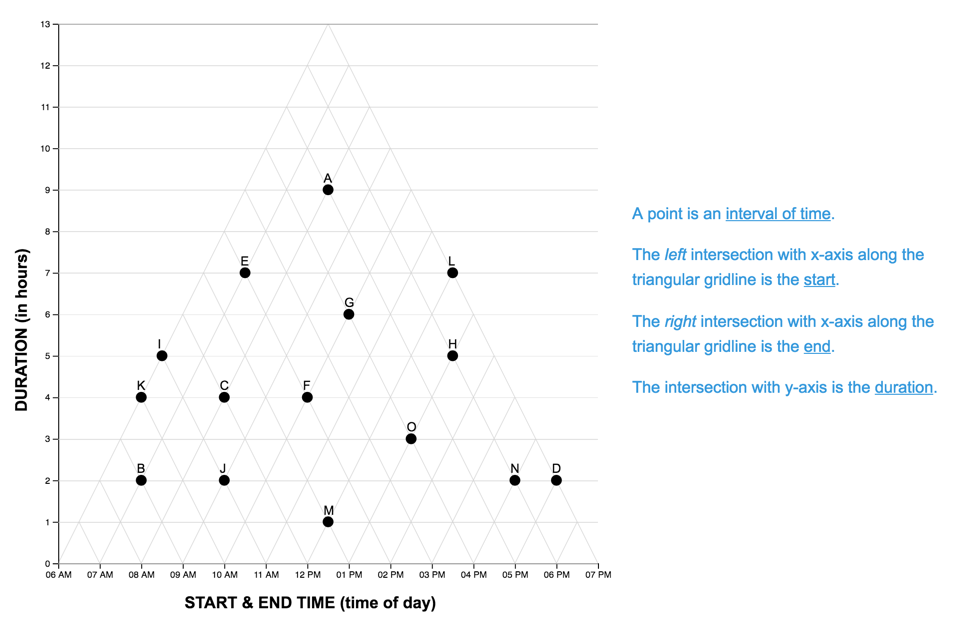</td> 
  </tr>
  <tr>
    <td>"how-text"</td>
    <td>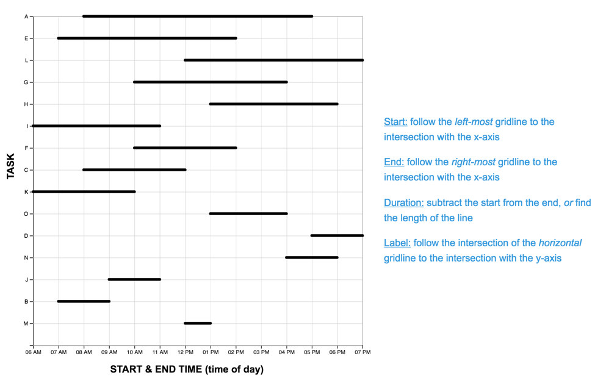</td> 
    <td>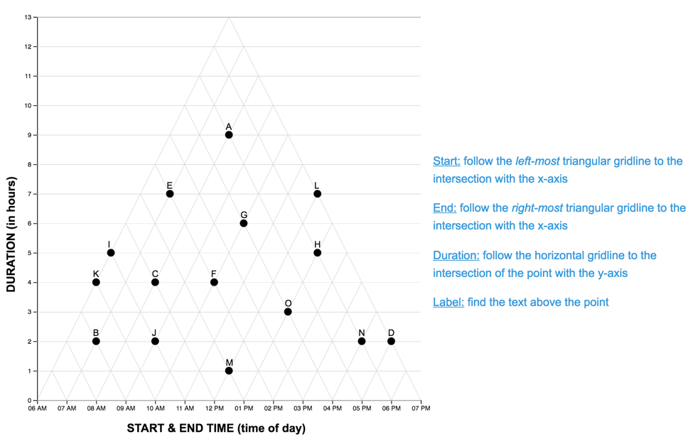</td> 
  </tr>
  <tr>
    <td>"static-image"</td>
    <td>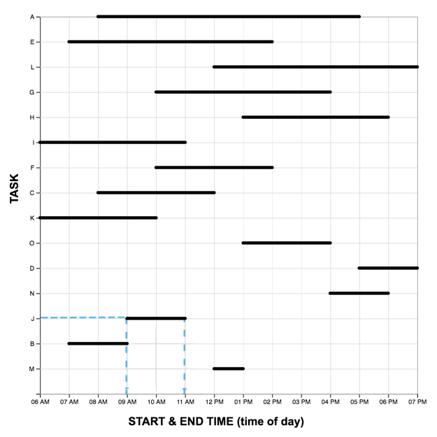</td> 
    <td>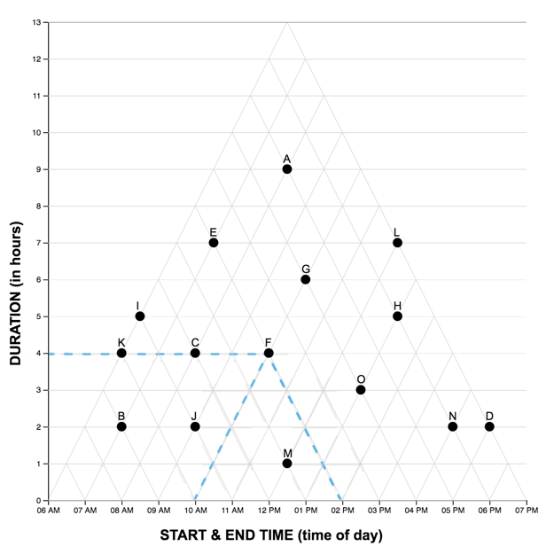</td> 
  </tr>
  <tr>
    <td>"interactive-image"</td>
    <td>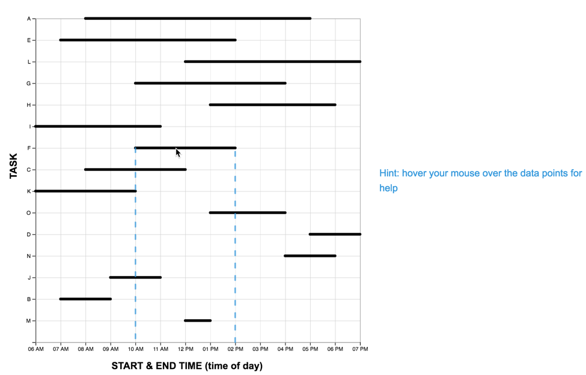</td> 
    <td>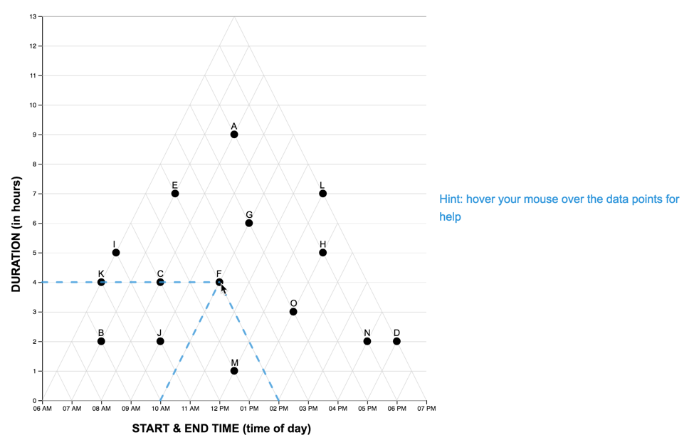</td> 
    <td></td>
  </tr>  
</table>
<!--/html_preserve-->
<br> <br>

#### The Graph Reading Task
Each graph reading task consisted of a graph (LM or TM) and 15 multiple choice questions (used in Study One). Questions were presented one at a time, and participants did not receive feedback as to the accuracy of their response before proceeding to the next question. The order of the first five (scaffolded) questions was the same for each participant, while the order of the remaining 10 were randomized. For each question, the stimulus software recorded the participant’s response accuracy (correct, incorrect) and latency (time from page-load to “submit” button press). As each participant completed the reading task once with each graph, we developed two matched scenarios: a project manager scheduling tasks (scenario A), and an events manager scheduling reservations (scenario B). In each scenario, an equivalent question can be identified in the other pertaining to the same interval property or relation. For the LM graphs, intervals were sorted in order of duration, with the longest intervals appearing at the top of the graph.A pilot study on Amazon Mechanical Turk using the LM graph revealed no significant differences in difficulty between the scenarios. The four graphs constructed for the study are shown below. 

<a href="Study2_files/questions.html"> **The full list of questions and correct answers can be found here** </a>.

<br> <br>
<!--html_preserve-->
<table style="width:100%">
  <tr>
    <th>Task Scheduling (Scenario A)</th>
    <th>Event Scheduling (Scenario B)</th> 
  </tr>
  <tr>
    <td></td> 
    <td></td> 
  </tr>
  <tr>
    <td>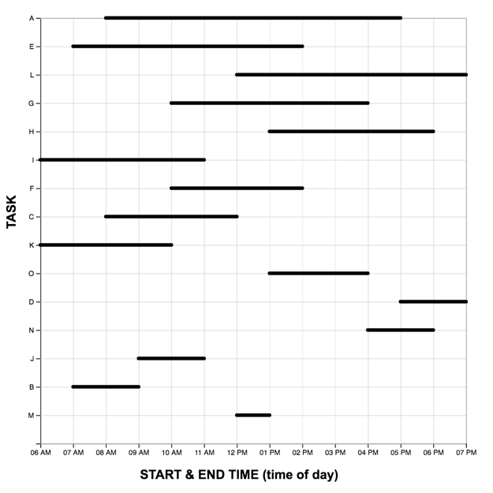</td> 
    <td>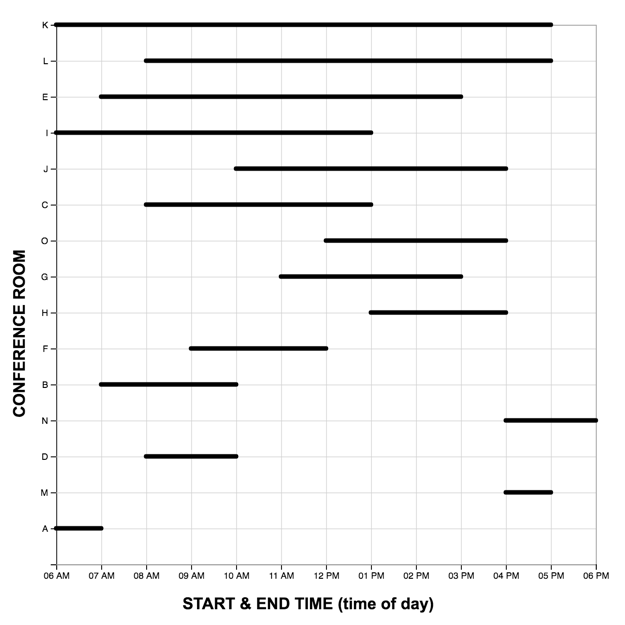</td> 
  </tr>
  <tr>
    <td>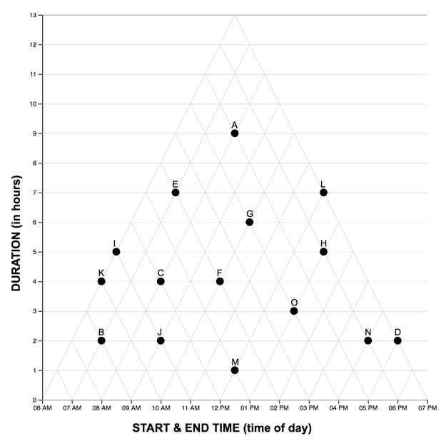</td> 
    <td></td> 
  </tr>
</table>
<!--/html_preserve-->
<br> <br>

#### The Graph Drawing Task
In the <a href="../Study2_files/drawing_task.pdf">graph drawing task</a> participants were given a sheet of isometric dot paper and a table containing a set of 10 time intervals. Isometric dot paper equally supports the construction of lines at 0, 45 and 90 degrees, thus minimizing any biasing effects of the paper on the type of graph the participants chose to draw.  Participants were directed to draw a triangular graph of the data (“like the triangle graph you saw in the previous task”), using the pencil, eraser and ruler provided. 
<br> <br>


### Procedure
Participants completed the study individually in a computer lab. After a short introduction they continued to the first of two graph reading tasks (graph order counterbalanced). After completing the first graph reading task, they were introduced to the second scenario, and completed the second graph reading task with the remaining graph. Finally, participants completed the graph drawing task. They finished the study by completing a short demographic survey, and reading the debriefing text. 
<br> <br>

## Results (Score) 
```{r echo = FALSE}
#SETUP DATA FOR RESPONSE ACCURACY ANALYSIS
# our data df_subjects is in wide format (repeated measures in different columns), however we need it in long format
w_scores = subset(df_subjects, select = c("subject","condition", "order", "lm_scenarios", "linear_score","triangular_score")) #create a wide form subset 
l_scores <-melt(w_scores, id=c("subject","condition", "order", "lm_scenarios"), measured=c("linear_score","triangular_score")) 

#convert other variables to factors
l_scores$condition <- factor(l_scores$condition)
l_scores$order <- factor(l_scores$order)
l_scores$lm_scenarios <- factor(l_scores$lm_scenarios)
levels(l_scores$condition)[levels(l_scores$condition)=="0"] <- "control"
levels(l_scores$condition)[levels(l_scores$condition)=="1"] <- "wtext"
levels(l_scores$condition)[levels(l_scores$condition)=="2"] <- "htext"
levels(l_scores$condition)[levels(l_scores$condition)=="3"] <- "simage"
levels(l_scores$condition)[levels(l_scores$condition)=="4"] <- "ximage"
l_scores$scaffold <-l_scores$condition
```

####Explore the data
*We see a large variance in TM scores across Graph-Orders*

```{r}
#EXPLORE THE DATA
#create boxplot

#SIMPLE BOXPLOT BY CONDITION
# mixedPlot_condition <- ggplot(l_scores, aes(condition,value, color=variable))+ geom_boxplot() +
#  labs(x="scaffold condition", y="score (max = 15)") +
#  ggtitle("Task Score by Scaffold ") +
#  theme_bw()
# mixedPlot_condition
  
#BOXPLOT BY CONDITION, FACET WITH ORDER
mixedPlot_order <- ggplot(l_scores, aes(condition,value, fill=variable))+ geom_boxplot() +
  facet_wrap(~order, labeller=labeller(order = order_labels)) +
  labs(x="scaffold condition", y="score (max = 15)", color="task")+ 
  labs(title="Task Score by Scaffold & Graph-Order ") +
  theme_bw() +
  theme(strip.background = element_blank()) +
  scale_fill_manual( values = c(green,red),
                       name="graphing task",
                       breaks=c("linear_score", "triangular_score"),
                       labels=c("linear", "triangular")) 
mixedPlot_order

#BOXPLOT BY CONDITION, FACET WITH ORDER AND SCENARIO
mixedPlot_scenario <- ggplot(l_scores, aes(condition,value, fill=variable))+ geom_boxplot() +
 facet_grid(lm_scenarios~order, labeller=labeller(order = order_labels)) +
 labs(x="scaffold condition", y="score (max = 15)")+
 ggtitle("Task Score by Scaffold, Task Order and Scenario ") +
 theme_bw() +
 theme(strip.background = element_blank()) +
 scale_fill_manual( values = c(green,red),
                       name="graphing task",
                       breaks=c("linear_score", "triangular_score"),
                       labels=c("linear", "triangular"))
  #use scale_fill_manual to manually change colors 
mixedPlot_scenario
``` 

```{r echo = FALSE}
#explore descriptive statistics based on each IV
#by(l_scores$value, list(l_scores$condition, l_scores$order, l_scores$variable), stat.desc, basic=FALSE)
```

####Hypothesis Testing

*Compute mixed effects ANOVA on Response Score*   
Significant main effect of Graph     F(1,297) = 97.67, p < .001   
Significant main effect of Scaffold  F(4,297) = 4.24, p < .01    
Significant main effect of Scenario  F(1,297) = 22.29, p < .001   
Significant interaction of Scaffold and Graph F(4,297) = 9.99, p <.001   
Significant interaction of Graph and Scenario F(1,297) = 34.80, p <.001   

```{r} 

#construct contrasts for ANOVA model
options(contrasts=c("contr.sum","contr.poly"))

#execute the model
mixedModel = ezANOVA(data = l_scores,
                     dv = .(value),
                     wid = .(subject),
                     between = .(condition,order,lm_scenarios),
                     within = .(variable),
                     type = 3,
                     detailed = TRUE)
mixedModel
#summary(mixedModel)
```


####MAIN EFFECT: Graph on SCORE   
On average, participants scored significantly higher on the linear model task (M = 10.96, SD = 2.13) than on the triangular model (M = 8.78 SD = 4.44), t(316) = 9.41, p < 0.001, r = 0.47

```{r} 
bar <- ggplot(l_scores, aes(x = variable, y= value, fill=variable))
bar + stat_summary(aes(y = value, group=variable), fun.y=mean,  geom="bar", position="dodge") +
      stat_summary(fun.data = mean_cl_normal, geom="errorbar", position = position_dodge(width=0.9),width=0.2) +
      labs (x = "Graph Task ", y= "Score", fill="Graph Task") +
      coord_cartesian(ylim=c(0,15)) +
      scale_x_discrete(labels=c("linear_score" = "Linear Graph (LM)", "triangular_score" = "Triangular Graph (TM)")) +
      theme_bw() +
      theme(strip.background = element_blank()) +
      ggtitle("Mean Score by Graph Task")+
      scale_fill_manual(values = c(green,red),
                        name = "Graph Task",
                        breaks =c("linear_score", "triangular_score"),
                        labels =c("linear","triangular"))
      
```

```{r}
#CALULCULATE POSTHOC DIFFERENCE & EFFECT SIZE
mainEffectGraph  <- t.test(value ~ variable, data=l_scores, paired=TRUE)
mainEffectGraph

t <-mainEffectGraph$statistic[[1]]
df <-mainEffectGraph$parameter[[1]]
r <- sqrt(t^2/(t^2+df))
round(r,3)
```

####MAIN EFFECT: Scaffold on SCORE
####MAIN EFFECT: Scenario on SCORE

When answering questions (with either graph) in the axis scenario (M = 9.20, SD = 4.12), participants had significantly lower scores, t(316) = -4.77, p < 0.001, r = -.26, than in the longmire scenario (M = 10.52, SD = 2.97)

```{r} 
bar <- ggplot(l_scores, aes(x = variable, y= value, fill=lm_scenarios))
bar + stat_summary(aes(y = value, group=lm_scenarios), fun.y=mean,  geom="bar", position="dodge") +
      stat_summary(fun.data = mean_cl_normal, geom="errorbar", position = position_dodge(width=0.9),width=0.2) +
      labs (x = "Graph Task", y= "Score", fill="") +
      coord_cartesian(ylim=c(0,15)) +
      scale_x_discrete(labels=c("linear_score" = "linear (LM)", "triangular_score" = "triangular (TM)")) +
      theme_bw() +
      theme(strip.background = element_blank()) +
      ggtitle("Mean Score by Scenario & Graph")+
      scale_fill_manual(values = c(blue,purple),
                        name = "Task Scenario",
                        breaks =c("axis","longmire"),
                        labels =c("axis","longmire"))
      
```

```{r} 
dots <- ggplot(l_scores, aes(x = lm_scenarios, y= value, color=variable))
dots + stat_summary(aes(y = value, group=variable), fun.y=mean,  geom="point", position = position_dodge(width=0.1),width=0.2) +
      stat_summary(fun.data = mean_cl_normal, geom="errorbar", position = position_dodge(width=0.1),width=0.2) +
      stat_summary(aes(y = value, group=variable), fun.y=mean,  geom="line", position=position_dodge(width=0.1)) +
      labs (x = "Task Scenario ", y= "Score", fill="Task Graph") +
      coord_cartesian(ylim=c(0,15)) +
      scale_x_discrete(labels=c("axis" = "axis", "longmire" = "longmire")) +
      theme_bw() +
      theme(strip.background = element_blank()) +
      ggtitle("Mean Score by Scenario & Graph")+
      scale_color_manual(values = c(green,red),
                        name = "Task Graph",
                        breaks =c("linear_score", "triangular_score"),
                        labels =c("linear (LM)","triangular (TM)"))
      
```

```{r echo = FALSE}
# #CALULCULATE POSTHOC DIFFERENCE & EFFECT SIZE
# mainEffectGraph  <- t.test(value ~ lm_scenarios, data=l_scores, paired=TRUE, na.rm=TRUE)
# mainEffectGraph
# 
# t <-mainEffectGraph$statistic[[1]]
# df <-mainEffectGraph$parameter[[1]]
# r <- sqrt(t^2/(t^2+df))
# round(r,3)
```


####INTERACTION: Scaffold & Graph   
####INTERACTION: Scenario & Graph   
 

## Results (Time)
```{r echo = FALSE}
#SETUP DATA FOR RESPONSE TIME ANALYSIS
# our data df_subjects is in wide format (repeated measures in different columns), however we need it in long format
w_times = subset(df_subjects, select = c("subject","condition", "order", "lm_scenarios", "LM_T_M","TM_T_M")) #create a wide form subset 
l_times <-melt(w_times, id=c("subject","condition", "order", "lm_scenarios"), measured=c("LM_T_M","TM_T_M")) 

#convert other variables to factors
l_times$condition <- factor(l_times$condition)
l_times$order <- factor(l_times$order)
l_times$lm_scenarios <- factor(l_times$lm_scenarios)
levels(l_times$condition)[levels(l_times$condition)=="0"] <- "control"
levels(l_times$condition)[levels(l_times$condition)=="1"] <- "wtext"
levels(l_times$condition)[levels(l_times$condition)=="2"] <- "htext"
levels(l_times$condition)[levels(l_times$condition)=="3"] <- "simage"
levels(l_times$condition)[levels(l_times$condition)=="4"] <- "ximage"
l_times$scaffold <-l_times$condition
```

####Explore the data
*We see comparable response times for LM and TM graphs when the LM graph is solved first.  However, when the TM graph is solved first, the TM graph-reading task seems to take much longer.*

```{r}
#EXPLORE THE DATA

#SIMPLE BOXPLOT BY CONDITION
# mixedPlot_condition <- ggplot(l_times, aes(condition,value, color=variable))+ geom_boxplot() +
#  labs(x="scaffold condition", y="time (mins)") +
#  ggtitle("Response Time by Scaffold ") +
#  theme_bw()
# mixedPlot_condition
  
#BOXPLOT BY CONDITION, FACET WITH ORDER
mixedPlot_order <- ggplot(l_times, aes(condition,value, fill=variable))+ geom_boxplot() +
  facet_wrap(~order, labeller=labeller(order = order_labels)) +
  labs(x="scaffold condition", y="time (mins)", color="task")+ 
  labs(title="Response Time by Scaffold & Graph-Order ") +
  theme_bw() +
  theme(strip.background = element_blank()) +
  scale_fill_manual( values = c(green,red),
                       name="graphing task",
                       breaks=c("LM_T_M", "TM_T_M"),
                       labels=c("linear", "triangular")) 
mixedPlot_order

#BOXPLOT BY CONDITION, FACET WITH ORDER AND SCENARIO
mixedPlot_scenario <- ggplot(l_times, aes(condition,value, fill=variable))+ geom_boxplot() +
 facet_grid(lm_scenarios~order, labeller=labeller(order = order_labels)) +
 labs(x="scaffold condition", y="time (mins)")+
 ggtitle("Response Time by Scaffold, Task Order and Scenario ") +
 theme_bw() +
 theme(strip.background = element_blank()) +
 scale_fill_manual( values = c(green,red),
                       name="graphing task",
                       breaks=c("LM_T_M", "TM_T_M"),
                       labels=c("linear", "triangular"))
mixedPlot_scenario
```


####Hypothesis Testing

*Compute mixed effects ANOVA on Response Time*   
Significant main-effect of Graph F(1,297) = 109.71, p <.001   
Significant interaction between Graph & Scaffold F(4,297) = 3.51, p < .01   
Significant interaction between Graph and Scenario, F(1,297) = 8.35, p <.01   
Significant interaction between Graph and Graph-Order, F(1,297) = 44.24, p <.001   

```{r} 

#construct contrasts for ANOVA model
options(contrasts=c("contr.sum","contr.poly"))

#execute the model
mixedModel = ezANOVA(data = l_times,
                     dv = .(value),
                     wid = .(subject),
                     between = .(condition,order,lm_scenarios),
                     within = .(variable),
                     type = 3,
                     detailed = TRUE)
mixedModel
#summary(mixedModel)
```


####MAIN EFFECT: Graph on TIME   
On average, participants spent significantly more time on triangular model task (M = 10.84, SD = 3.28) than on the linear model (M = 9.20, SD = 2.53), t(316) = -9.46, p < 0.001, r = 0.47

```{r echo = FALSE } 
bar <- ggplot(l_times, aes(x = variable, y= value, fill=variable))
bar + stat_summary(aes(y = value, group=variable), fun.y=mean,  geom="bar", position="dodge") +
      stat_summary(fun.data = mean_cl_normal, geom="errorbar", position = position_dodge(width=0.9),width=0.2) +
      labs (x = "Graph Task ", y= "Response Time (minutes)", fill="Graph Task") +
      coord_cartesian(ylim=c(0,15)) +
      scale_x_discrete(labels=c("LM_T_M" = "Linear Graph (LM)", "TM_T_M" = "Triangular Graph (TM)")) +
      theme_bw() +
      theme(strip.background = element_blank()) +
      ggtitle("Mean Response Time by Graph Task")+
      scale_fill_manual(values = c(green,red),
                        name = "Graph Task",
                        breaks =c("LM_T_M", "TM_T_M"),
                        labels =c("linear","triangular"))
```

```{r echo = FALSE}
#CALULCULATE POSTHOC DIFFERENCE & EFFECT SIZE
mainEffectGraph  <- t.test(value ~ variable, data=l_times, paired=TRUE)
mainEffectGraph

t <-mainEffectGraph$statistic[[1]]
df <-mainEffectGraph$parameter[[1]]
r <- sqrt(t^2/(t^2+df))
round(r,3)
```


####INTERACTION: Scaffold & Graph   
####INTERACTION: Scenario & Graph   
####INTERACTION: Order & Graph   

## Results (Graph Drawing) 

## References

Qiang, Y., Valcke, M., De Maeyer, P., & Van de Weghe, N. (2014). Representing time intervals in a two-dimensional space: An empirical study. Journal of Visual Languages and Computing, 25(4), 466–480. 


