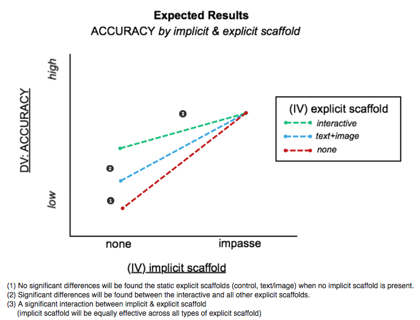
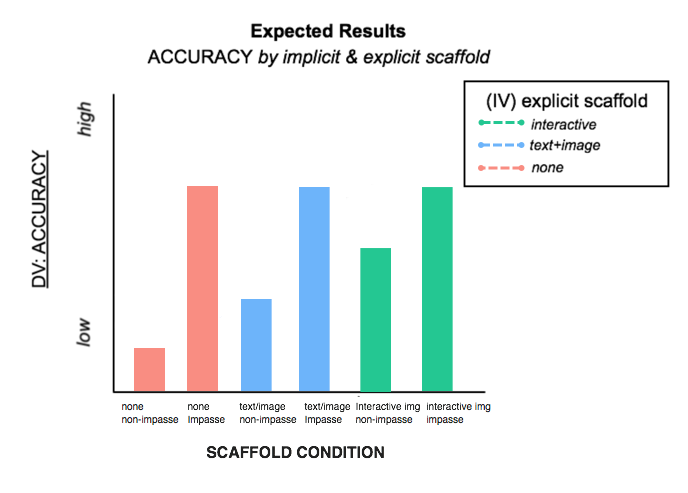

```{r setup, include=FALSE}
knitr::opts_chunk$set(echo = TRUE)

#IMPORT LIBRARIES
library(jsonlite)
library(tables) # pretty tables
library(pastecs) #stat.desc
library(ggplot2) #graphs
library(car) #ANOVA

#Create data frame for participant file
participant_file <- "../STUDY_3/Analysis/data/final_participants.json"
df_subjects_3 <- fromJSON(participant_file)

#set condition levels as factors
levels(df_subjects_3$impasse)<- c("1","2")
levels(df_subjects_3$explicit)<- c("1","2","3")
levels(df_subjects_3$condition)<- c("111","121","211","221","311","321")

df_subjects_3$explicit<-factor(df_subjects_3$explicit)
df_subjects_3$impasse<-factor(df_subjects_3$impasse)

#Create factor vectors
EXPLICIT <- factor(df_subjects_3$explicit, levels = c(1,2,3), labels = c("none", "text/image", "interactive"))
IMPASSE  <- factor(df_subjects_3$impasse, levels = c(1,2), labels = c("none", "impasse"))
AXIS  <- factor(df_subjects_3$axis)
CONDITION <-factor(df_subjects_3$condition)

df_subjects_3$tt_min <- df_subjects_3$triangular_time / 1000 / 60

#Count number of participants
nSubjects <- nrow(df_subjects_3)
nFemale <-sum(df_subjects_3$sex == "Female")
```

```{r echo = FALSE}
#SETUP LABELS AND COLORS FOR GRAPHS
  red = "#F8766D"
  green = "#1cc07e"
  blue = "#59A1FC"
  purple = "#C680FD"
  none = "#7E7D7E"
```

#Comparing Explicit and Implicit Scaffolding   {.tabset .tabset-fade .tabset-pills} 
<br> 

##Introduction   
The purpose of this study is to compare the relative efficacy of *explicit* (ie. visually-salient text or images that serve instructional purpose) and *implicit* (ie. task and question structure) scaffolding for an unconventional statistical graph.  We hypothesize that implicit techniques---specifically presenting a task that forms a **mental impasse** for the reader---will be more supportive of correct graph interpretation than explicit graph-reading instructions.  We base this hypothesis on prior observation and experimental work (Fox & Hollan, *in preparation*) which revealed that when presented with an unconventional graph with structural elements (ie. axes and grid) that resembled conventional graphs, learners did not always realize they did not understand how the graph was meant to be read. We propose that prior knoweldge of conventional graph systems acts as a form of "graphical fixedness", that learners must overcome to form correct mental models for new representational systems. 
<br><br>

###Hypotheses
Based on the results from Study 2 we predict ...   
<br>
<!--html_preserve-->
 
<!--/html_preserve-->

##Methods

###Design
We utilized a 3 (explicit scaffold: none, text/image, interactive) X 2 (implicit scaffold: none, impasse) between-subjects factorial design, with response time and score (max = 15) as dependent variables.   
<br>   

```{r results = 'asis', echo = FALSE}
#create table of participants by factors (explicit X impasse)
table <- tabular( (IMPASSE+1)~(EXPLICIT+1), data = df_subjects_3 )
table_options(rowlabeljustification="center", justification="right")
html(table,options=htmloptions(head=TRUE))
```   
<br>

###Participants

**`r nSubjects` students ** (``r round(nFemale/nSubjects,digits = 2) * 100`` % female) registered as STEM majors at a public university in the United States participated in exchange for course credit (age: ``r min(df_subjects_3$age)`` - ``r max(df_subjects_3$age)`` years).
<br><br>

###Measures
```{r echo = FALSE}
#EXPLORE SAMPLE STATISTICS

#describe the sample
describe_score<-stat.desc(df_subjects_3$triangular_score) 
describe_time<-stat.desc(df_subjects_3$tt_min) 

time_min = round(describe_time[4], 0)
time_max = round(describe_time[5], 0)
time_m = round(describe_time[9], 0)
time_sd = round(describe_time[10], 2)
 
score_min = round(describe_score[4], 0)
score_max = round(describe_score[5], 0)
score_m = round(describe_score[9], 0)
score_sd = round(describe_score[10], 2)

#tests for normalcy
score_normal <- shapiro.test(df_subjects_3$triangular_score)
time_normal <- shapiro.test(df_subjects_3$tt_min)

```

####Response Accuracy   
The mean score across the entire sample was approximately `r score_m` points (out of 15), with a standard deviation of `r score_sd` , and values ranging from `r score_min` to `r score_max`  points.    
<br> <br> <br> 
```{r echo = FALSE}
#SCORE HISTOGRAM
HIST_score <-ggplot(df_subjects_3, aes(triangular_score)) 
HIST_score + geom_histogram(binwidth=1) + 
  coord_cartesian(xlim=c(0,15)) +
  ggtitle("Total Score") + 
  labs(x="Score (points)", y="Number of Participants") + 
  theme_bw()+
  theme(strip.background = element_blank())+
  theme(plot.title = element_text(family = "Helvetica", color="#666666", face="bold", size=14, hjust=0.5)) + 
  theme(axis.title = element_text(family = "Helvetica", color="#666666", face="bold", size=10)) +
  theme(panel.border = element_blank())
```

<br><br> 
<span style="color:red"> 
A Shapiro-Wilk test for normality yielded a value of ```r score_normal[1]```, p = ```r score_normal[2]``` suggesting that the distibution is significantly non-normal.    
</span>    
<br><br> 

```{r echo = FALSE}
#BOXPLOT of SCORE BY EXPLICIT & IMPLICIT
BP_score <- ggplot(df_subjects_3, aes(EXPLICIT,triangular_score, fill=IMPASSE))+ geom_boxplot() +
  labs(x="Explicit Scaffold", y="Total Score (points)", color="IMPASSE")+ 
  ggtitle("Score by Scaffold & Impasse") +
  theme_bw() +
  theme(strip.background = element_blank()) +
  scale_fill_manual(   values = c(red,green),
                       name="Impasse",
                       breaks=c(1, 2),
                       labels=c("control", "impasse"))
BP_score
```
<br> <br> <br>
```{r echo = FALSE}
#ASSESS NORMALITY OF SCORE
QP_time <- qplot(sample = df_subjects_3$triangular_score, main="Q-Q Plot: SCORE") + theme_bw() 
QP_time
```

####Response Latency
The mean total runtime across the sample was approximately `r time_m` minutes, with a standard deviation of `r time_sd` minutes, and values ranging from `r time_min` to `r time_max`  minutes. 
<br><br><br>
```{r echo = FALSE}
#TIME HISTOGRAM
HIST_time <-ggplot(df_subjects_3, aes(tt_min)) 
HIST_time + geom_histogram(binwidth=1) + 
  coord_cartesian(xlim=c(0,15)) +
  ggtitle("Response Time") + 
  labs(x="Time (min)", y="Number of Participants") + 
  theme_bw()+
  theme(strip.background = element_blank())+
  theme(plot.title = element_text(family = "Helvetica", color="#666666", face="bold", size=14, hjust=0.5)) + 
  theme(axis.title = element_text(family = "Helvetica", color="#666666", face="bold", size=10)) +
  theme(panel.border = element_blank())
```

<br><br>
<span style="color:red"> 
A Shapiro-Wilk test for normality yielded a value of ```r time_normal[1]```, p = ```r time_normal[2]``` suggesting that the data are from a non-normally-distributed population. 
</span>    
<br><br>

```{r echo = FALSE}
#BOXPLOT of TIME BY EXPLICIT & IMPLICIT
BP_time <- ggplot(df_subjects_3, aes(EXPLICIT,tt_min, fill=IMPASSE))+ geom_boxplot() +
  labs(x="Explicit Scaffold", y="Time (min)", color="IMPASSE")+ 
  ggtitle("Time by Scaffold & Impasse") +
  theme_bw() +
  theme(strip.background = element_blank()) +
  scale_fill_manual(   values = c(red,green),
                       name="Impasse",
                       breaks=c(1, 2),
                       labels=c("control", "impasse"))
BP_time
```
<br> <br> <br>
```{r echo = FALSE}
#ASSESS NORMALITY OF TIME
QP_time <- qplot(sample = df_subjects_3$tt_min, main="Q-Q Plot: TIME") + theme_bw() 
QP_time
```


##Results: Response Accuracy

####EXPECTED RESULTS 
<!--html_preserve-->
 
<!--/html_preserve-->
<br> 

####ACTUAL RESULTS 

```{r}
#BAR CHART OF SCORE RESULTS
bar <- ggplot(df_subjects_3, aes(x = condition, y= triangular_score, fill=explicit))
bar + stat_summary(aes(y = triangular_score, group=condition), fun.y=mean,  geom="bar", position="dodge") +
      stat_summary(fun.data = mean_cl_normal, geom="errorbar", position = position_dodge(width=0.9),width=0.2) +
      coord_cartesian(ylim=c(0,15)) +
      theme_bw() +
      theme(strip.background = element_blank()) +
      labs (x = "Scaffold Condition ", y= "Score", fill="Explicit Scaffold") +
      scale_x_discrete(labels=c("none", "impasse","none", "impasse","none", "impasse"))+
      scale_fill_manual( values = c(red,blue,green),
                       name="Explicit Scaffold",
                       breaks=c(1,2,3),
                       labels=c("none","text/image","interactive")) +
      ggtitle("Mean Score by Explicit & Implicit Scaffolds")
```
<br><br>

```{r}
#SCATTERPLOT OF SCORE RESULTS
#scatter <- ggplot(df_subjects_3, aes(x = explicit, y= triangular_score, color=impasse, shape=impasse))
#scatter + geom_jitter()+
#      coord_cartesian(ylim=c(0,15)) +
#      theme_bw() +
#      theme(strip.background = element_blank()) +
#      labs (x = "Scaffold Condition ", y= "Score", fill="Condition") +
#      scale_x_discrete(breaks=c(1,2,3),
#                       labels=c("none","text/image","interactive"))+
#      scale_color_manual( values = c(red,green),
#                       name="Impasse",
#                       breaks=c(1,2),
#                       labels=c("none","impasse")) +
#      scale_shape_manual( values = c(19,17),
#                       name="Impasse",
#                       breaks=c(1,2),
#                       labels=c("none","impasse")) +
#      labs(title = "Score by implicit and explicit scaffold",
#      subtitle = " ") 
```
<br>

```{r}
#SCATTERPLOT OF SCORE RESULTS
#scatter <- ggplot(df_subjects_3, aes(x = impasse, y= triangular_score, color=explicit, shape=explicit))
#scatter + geom_jitter()+
#      coord_cartesian(ylim=c(0,15)) +
#      theme_bw() +
#      theme(strip.background = element_blank()) +
#      labs (x = "Scaffold Condition ", y= "Score", fill="Condition") +
#      scale_x_discrete(breaks=c(1,2),
#                       labels=c("none","impasse"))+
#      scale_color_manual( values = c(red,blue,green),
#                       name="Explicit",
#                       breaks=c(1,2,3),
#                       labels=c("none","text/image","interactive"))+
#      scale_shape_manual( values = c(19,17,15),
#                       name="Explicit",
#                       breaks=c(1,2,3),
#                       labels=c("none","text/image","interactive"))+
#      labs(title = "Score by implicit and explicit scaffold",
#      subtitle = " ") 
```


####DESCRIPTIVE STATISTICS

The mean score across the entire sample was approximately `r score_m` points (out of 15), with a standard deviation of `r score_sd` , and values ranging from `r score_min` to `r score_max`  points.    
<br> 

```{r results = 'asis', echo = FALSE}
#Create a tables of means for task scores 
table<- tabular( (IMPASSE) ~ (Heading("EXPLICIT Scaffold")*EXPLICIT)
                            *(Heading("")*triangular_score) 
                            *(mean+sd)
                            *Format(digits=2),
                            data=df_subjects_3)
html(table,options=htmloptions(head=TRUE))
#latex(table)
```
<br><br>

```{r results = 'asis', echo = FALSE}
#Create a tables of means for task scores 
table<- tabular( (IMPASSE * EXPLICIT) ~ (Heading("Orthogonal Response")*orthogonal_score + Heading("Triangular Response")*triangular_score)
                            *(mean+sd)
                            *Format(digits=0),
                            data=df_subjects_3)
html(table,options=htmloptions(head=TRUE))
#latex(table)
```
<br><br>


####HYPOTHESIS TESTING

##### H1. Equality of control & text/image explicit scaffold 
Replicating results from Study 2, we predicted that no significant differences would be found between the control (no explicit scaffold) and text/image explicit scaffold condition (with non-impasse problems)

##### H2. Superiority of interactive explicit scaffold
Replicating results from Study 2, we predicted that the interactive explicit condition would yield significantly higher accuracy scores than either the text/image or control conditions  (with non-impasse problems)

##### H3. Interaction between implicit and explicit scaffolds
We predict a signficant interaction between implicit and explicit scaffold conditions.  We predict that in the implicit-control (non-impasse) condition, the explicit scaffolds will be perform consistent with the findings of study 2.  Conversely, under the implicit scaffold condition (impasse problem), the three explicit scaffolds will perform equally well, at performance ceiling. 


####EXPLORATION

####Factorial ANOVA :: SCORE by EXPLICIT*IMPLICIT    

#####Model Pre-requisites   
1. Data Independence --> YES   
2. Normality --> NO  (see Methods > Measures :: Scores are not normally-distributed)     
3. Equality of variances between groups --> NO (see Methods > Measures for boxplot)    
4. Balance design --> YES (equal number of obervations per group )   
*The data do meet the criteria to use ANOVA for analysis*   

```{r collapse = TRUE}
#3. Equality of variance between groups
tapply(df_subjects_3$triangular_score, INDEX=df_subjects_3$condition, FUN=var)  

#3. Balance design
tapply(df_subjects_3$triangular_score, INDEX=df_subjects_3$condition, FUN=length)  
```

#####Expected Results
<!--html_preserve-->
 
<!--/html_preserve-->
<br> 

#####Model Results
The results of a 3 (explicit-scaffold) X 2 (implicit-scaffold) factorial ANOVA reveal significant main effects of explicit-scaffold and (F = 50.75, p < 0.001) implicit-scaffold (F = 8.1, p = 0.005). The interaction between explicit & implict scaffolds was non-significant (F = 0.98, p = 0.38).

```{r collapse=TRUE}
#FACTORIAL ANOVA ON SCORE 
aov.out = aov(triangular_score ~ explicit * impasse, data=df_subjects_3)
options(show.signif.stars=T)
summary(aov.out)
options(show.signif.stars=T)
        TukeyHSD(aov.out, show.signif.stars=T)
       
# library(phia)  
# plot(interactionMeans(aov.out))  

```
<br><br>
```{r echo = FALSE}
#INTERACTION PLOT FOR SCORE
ggplot(df_subjects_3)+
  aes(x = IMPASSE, y = triangular_score, color = EXPLICIT, group=EXPLICIT) +
  stat_summary(fun.y=mean, geom="point") +
  stat_summary(fun.y=mean, geom="line") +
  stat_summary(fun.data = mean_se, geom = "errorbar", width=0.1) +
  coord_cartesian(ylim= c(1,15)) +
  labs(title = "Effect of implict & explicit scaffolds on Score",
       subtitle = "Error bars indicate standard error of the mean") +
  xlab("Implicit Scaffold")+
  ylab("Score")+
  scale_color_manual( values = c(red,blue,green),
                       name="Explicit Scaffold",
                       breaks=c(1,2,3),
                       labels=c("none","text/image","interactive")) 
```


####One way ANOVA :: SCORE by CONDITION
What between-group differences are significant?    
*note: the data do not meet pre-requisites for ANOVA*   
<br>
A one-way analysis of variance reveals significant differences between scaffold conditions (F = 22.3, p < 0.001). Post-hoc Tukey tests reveal differences between the following conditions: 

**(non-impasse)**   
111-211 p = 0.0001186 *** expected       
211-311 p = 0.0109090 .   expected    
311-111 p = 0.0000000 *** expected    

**(impasse)**   
*121-221 p = 0.0003665* *** **NOT EXPECTED**   
221-321 p = 0.4419876     expected   
*321-121 p = 0.0000001* *** **NOT EXPECTED**    

**(between)**   
221-111 p = 0.0000000 *** expected     
321-111 p = 0.0000000 *** expected       
*311-121 p = 0.0000016*   **NOT EXPECTED**    
321-211 p = 0.0017176 ***    
*121-111 p = 0.1916933* x **NOT EXPECTED**     
*211-121 p = 0.2244351* x **NOT EXPECTED**      
*221-211 p = 0.2905214* x **NOT EXPECTED**     
*311-221 p = 0.7582001* x **NOT EXPECTED**     
*321-311 p = 0.9974622* x **NOT EXPECTED**     

```{r collapse = TRUE}
aov.out = aov(triangular_score ~ condition, data=df_subjects_3)   
options(show.signif.stars=T)
summary(aov.out)
options(show.signif.stars=T)
        TukeyHSD(aov.out, show.signif.stars=T)

```


####HYPOTHESIS 1: The formation of a question as a mental impasse will significantly improve performance on the problems

```{r collapse=TRUE}
#CALULCULATE PAIRWISE DIFFERENCE & EFFECT SIZE (independent sample t-test with numeric y and binary x)
mainEffectGraph  <- t.test(triangular_score ~ impasse, data=df_subjects_3)
mainEffectGraph

t <-mainEffectGraph$statistic[[1]]
t <-round(t,2)
df <-round(mainEffectGraph$parameter[[1]],0)
p <-mainEffectGraph[3] 
r <- sqrt(t^2/(t^2+df))
r <-round(r,2)
r

#explore descriptive statistics based on each IV
desc_control <- by(df_subjects_3$triangular_score, list(df_subjects_3$impasse), stat.desc, basic=FALSE)
desc_control
nonimpasse_mean = desc_control$`1`[2]
nonimpasse_SD = desc_control$`1`[6]
impasse_mean = desc_control$`2`[2]
impasse_SD = desc_control$`2`[6]
```

The main effect of impasse in the factorial ANOVA support this claim. Additionally, a post-hoc independent samples t-test reveals that participants (in any scaffold condition) presented with non-impasse questions (M = `r round(nonimpasse_mean,2)`, SD = `r round(nonimpasse_SD)`) are significantly *lower* than those with impasse questions (M = `r round(impasse_mean,2)`, SD = `r round(impasse_SD)`), t(`r df`) = `r t`, p = `r p[[1]]` , r = `r r`. 


##### A) Examine enter question set (only first 5 are scaffolded)
##### B) Examine scaffolded phase only 


## Results: Response Time

```{r results = 'asis', echo = FALSE}
#Create a tables of means for task runtime 
table<- tabular( (IMPASSE) ~ (Heading("EXPLICIT Scaffold")*EXPLICIT)
                            *(Heading("")*tt_min) 
                            *(mean + sd)
                            *Format(digits=2), 
                            data=df_subjects_3)
html(table,options=htmloptions(head=TRUE))
#latex(table)
```
<br><br><br>
```{r echo = FALSE}
model = lm(tt_min ~ explicit + impasse + explicit:impasse,
           data = df_subjects_3)
Anova(model,type = "II")
```
<br><br><br>
```{r echo = FALSE}
#INTERACTION PLOT FOR TIME
ggplot(df_subjects_3)+
  aes(x = IMPASSE, y = tt_min, colour = EXPLICIT, group=EXPLICIT) +
  stat_summary(fun.y=mean, geom="point") +
  stat_summary(fun.y=mean, geom="line") +
  # stat_summary(fun.data = mean_se, geom = "errorbar", width=0.1) +
  coord_cartesian(ylim= c(1,15)) +
  labs(title = "Effect of implict & explicit scaffolds on Time",
       subtitle = "Error bars indicate standard error of the mean") +
  xlab("Implicit Scaffold")+
  ylab("Score")
```


##Post-Hoc Analyses
##Item Analyses


###Alternative Answers

Mean scores for explicit(control)+impasse are significantly higher than for explicit(control)+non-impasse. However, the variance is also high, suggesting that while some learners were given pause to re-evaluate their interpretation, others persisted with incorrect answers. 

*What are the alternative (wrong) answers for individuals in the explicit(control)+impasse condition?*